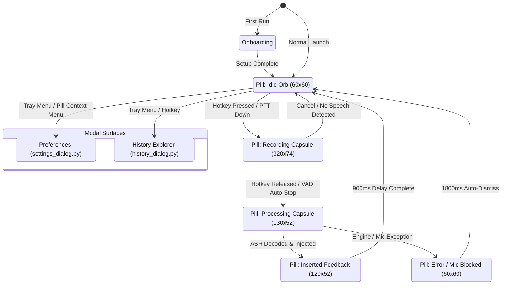

# Dictate User Interface (UI) Architecture

The `ui/` directory houses the entire visual layer, interaction pipeline, and design system of Dictate. The application implements a dual-layer design language tailored for modern desktop workflows: an ambient **Apple-inspired Liquid Glass functional HUD** for floating controls, paired with a **Google Material 3 Monochrome design system** for structured configuration and management windows.

---

## Table of Contents
1. [Design Philosophy & Core Directives](#design-philosophy--core-directives)
2. [End-to-End User Journey & UI Flow](#end-to-end-user-journey--ui-flow)
3. [Component State Machine](#component-state-machine)
4. [File Utility & Architectural Breakdown](#file-utility--architectural-breakdown)
5. [Visual & Technical Engineering Standards](#visual--technical-engineering-standards)

---

## 1. Design Philosophy & Core Directives

Dictate is designed to be an invisible, ambient productivity tool that feels completely native to modern desktop environments (macOS Sequoia / Windows 11).

```
┌────────────────────────────────────────────────────────────────────────┐
│                        DUAL-LAYER UI ARCHITECTURE                      │
├───────────────────────────────────┬────────────────────────────────────┤
│   FUNCTIONAL HUD LAYER (Ambient)  │   STRUCTURAL APP LAYER (Surfaces)  │
│   • Apple Liquid Glass Shaders    │   • Google Material 3 Monochrome   │
│   • Physical Optical Refraction   │   • Tonal Surface Elevation Ladder │
│   • Morphing Concentric Geometry  │   • Zero Blur / Crisp Hairlines    │
│   • Zero Focus Stealing (Win32)   │   • High Contrast & Accessibility  │
│   [pill.py, preview_overlay.py]   │   [settings, history, onboarding]  │
└───────────────────────────────────┴────────────────────────────────────┘
```

### Core UI Directives
1. **Zero Focus Stealing (`WS_EX_NOACTIVATE`):** Floating widgets (the Pill and Preview HUD) never steal keyboard or OS window focus from the active text editor, terminal, browser, or IDE. The user can dictate directly into any active input without interruption.
2. **Backdrop Exclusion (`WDA_EXCLUDEFROMCAPTURE`):** Floating overlays are marked with Windows Display Affinity flags so real-time screen-space shaders capture only the true underlying desktop content without feedback loops or recursive self-capture.
3. **Concentric Geometry:** Radii follow physical concentricity ($R_{\text{inner}} = R_{\text{outer}} - \text{padding}$), ensuring smooth, balanced visual harmony across nested containers.
4. **Immediate Perception (<140ms Feedback):** Audio level fluctuations and state shifts trigger instantaneous micro-animations (spring curves and breathing pulses) so the user always has clear awareness of listening, processing, and insertion.

---

## 2. End-to-End User Journey & UI Flow

```
┌─────────────────┐       ┌─────────────────┐       ┌──────────────────┐
│  1. First Run   │  ──>  │ 2. Ambient Idle │  ──>  │ 3. Push-to-Talk  │
│  Onboarding     │       │ Orb & System    │       │ (Pill Expands +  │
│  (onboarding.py)│       │ Tray Indicator  │       │ Waveform + Live) │
└─────────────────┘       └─────────────────┘       └──────────────────┘
                                                              │
                                                              ▼
┌─────────────────┐       ┌─────────────────┐       ┌──────────────────┐
│ 6. Management   │  <──  │ 5. Paste Text   │  <──  │ 4. VAD Silence   │
│ (Settings &     │       │ & History Log   │       │ Auto-Stop        │
│ History Dialog) │       │ (Green Check)   │       │ (Compact Capsule)│
└─────────────────┘       └─────────────────┘       └──────────────────┘
```

### 1. First-Run Onboarding (`onboarding.py`)
- **Trigger:** First application launch (`onboarding_completed: false`).
- **Experience:** A 3-step navigation-rail wizard with smooth opacity entrance:
  - **Step 1 (Welcome):** Clear privacy guarantee emphasizing 100% offline, local speech processing.
  - **Step 2 (Setup):** Interactive global hotkey recorder (`KeyCaptureButton`) and automatic verification of bundled offline neural speech models.
  - **Step 3 (Get Started):** Optional Cloud AI Polish toggle (with clear data handling disclosures) and test dictation prompt.

### 2. Ambient Readiness & System Tray (`tray.py` + `pill.py`)
- **Experience:** Dictate operates silently in the background. 
- **Floating Orb:** A signature circular Liquid Glass orb ($60 \times 60\,\text{px}$) floats unobtrusively on-screen with an idle microphone icon. It is smoothly draggable and remembers its coordinates across sessions.
- **System Tray:** A crisp monochrome microphone icon provides immediate right-click access to Settings, History, Quick Actions, and Quit.

### 3. Live Dictation & Streaming Preview (`pill.py` + `preview_overlay.py`)
- **Trigger:** Pressing the global hotkey (e.g., `Ctrl+Shift+P` in Push-to-Talk or Toggle mode).
- **Pill Morphing:** The orb seamlessly morphs into an expanded horizontal glass capsule ($320 \times 74\,\text{px}$):
  - **Top Row:** Active mic glyph + dynamic 5-bar fluid equalizer animating in Ice Cyan / Soft Rose based on real-time audio RMS.
  - **Bottom Row:** High-contrast streaming interim transcription with edge fading.
- **Subtitle Preview (`preview_overlay.py`):** If enabled, a floating subtitle HUD tracks near the active cursor or pill, displaying a 4-word sliding window with the latest active word highlighted.

### 4. Acoustic Auto-Stop & Processing (`pill.py`)
- **Trigger:** Semantic VAD detects thought completion or silence threshold ($1.4\,\text{s}$).
- **Pill Morphing:** Shrinks to a compact processing capsule ($130 \times 52\,\text{px}$) with pulsing breathing dots and `"Processing speech…"`. Offline Parakeet/SenseVoice decodes the full acoustic audio while preserving background UI responsiveness.

### 5. Instant Text Injection & Visual Confirmation
- **Trigger:** Transcription completes.
- **Injection:** Direct paste (`Ctrl+V` / synthetic keystrokes) into the previously focused application window.
- **Pill Morphing:** Capsule displays an emerald checkmark with `"Inserted"`, then springs back to the circular idle glass orb ($60 \times 60\,\text{px}$) after $900\,\text{ms}$.
- **History Record:** The utterance is automatically logged to `history.json`.

### 6. Audit, Preferences & Maintenance (`history_dialog.py` + `settings_dialog.py`)
- **History Explorer:** Rich card-based log of all past dictations with duration, word count, target app badges, search, and one-click re-injection.
- **Settings Dialog:** Material 3 tabbed interface (General, Dictation, Audio, Advanced) allowing live mic testing, hotword boosting configuration, hardware acceleration toggles, and model selection.

---

## 3. Component State Machine



---

## 4. File Utility & Architectural Breakdown

| File | Primary Role & Use Case | Design Language & Key Techniques |
|---|---|---|
| **[`pill.py`](file:///c:/Dodo%20Drive/Hermes%20Agent/Projects/dictate/ui/pill.py)** | Floating shape-shifting status pill and interactive dictation indicator. | **Apple Liquid Glass + Spring Motion:** Two-pass GDI screen-space capture, Snell's law refraction shader, dynamic waveform equalizer, context menu, and draggable geometry. |
| **[`preview_overlay.py`](file:///c:/Dodo%20Drive/Hermes%20Agent/Projects/dictate/ui/preview_overlay.py)** | Floating real-time subtitle HUD for streaming interim words. | **Monochrome Subtitle HUD:** 4-word sliding window with active word emphasis, smooth opacity fade-out, and non-activating window flags. |
| **[`liquid_glass_shader.py`](file:///c:/Dodo%20Drive/Hermes%20Agent/Projects/dictate/ui/liquid_glass_shader.py)** | GPU-accelerated NumPy shader engine for optical glass simulation. | **Optical Physics Engine:** Cauchy chromatic dispersion ($R/G/B$), Blinn-Phong specular glints, screen-center light tracking, and concentric inner rim lighting. |
| **[`settings_dialog.py`](file:///c:/Dodo%20Drive/Hermes%20Agent/Projects/dictate/ui/settings_dialog.py)** | Preferences window for engine, audio, hotkeys, and AI polish. | **Material 3 Monochrome:** 4 categorized tabs (General, Dictation, Audio, Advanced), live audio level meter, key capture button, and model dropdowns. |
| **[`history_dialog.py`](file:///c:/Dodo%20Drive/Hermes%20Agent/Projects/dictate/ui/history_dialog.py)** | Full-text searchable transcript archive and export tool. | **M3 Card Explorer:** Real-time search filter, aggregate stat counters (total words/time), one-click clipboard copy, re-injection to target window, and Markdown/TXT export. |
| **[`onboarding.py`](file:///c:/Dodo%20Drive/Hermes%20Agent/Projects/dictate/ui/onboarding.py)** | First-run interactive onboarding wizard. | **M3 Navigation Rail:** 3-step progressive disclosure, animated opacity transitions, hardware model readiness checks, and global shortcut setup. |
| **[`tray.py`](file:///c:/Dodo%20Drive/Hermes%20Agent/Projects/dictate/ui/tray.py)** | System tray icon, status indicator, and global context menu. | **System Integration:** Dynamic QPainter icon generation with live status badge indicators (Green = Ready, Orange = Recording, Blue = Processing). |
| **[`material_theme.py`](file:///c:/Dodo%20Drive/Hermes%20Agent/Projects/dictate/ui/material_theme.py)** | Material 3 tonal surface tokens and dynamic QSS stylesheet compiler. | **M3 Token Engine:** Single source of truth for dark/light surface elevation ladder (`surface_dim` to `surface_container_highest`), outlines, and typography scales. |
| **[`theme.py`](file:///c:/Dodo%20Drive/Hermes%20Agent/Projects/dictate/ui/theme.py)** | Design tokens, typography hierarchy, and concentric geometry constants. | **Liquid Glass Tokens:** Geometry dimensions (`WIDTH_IDLE`, `WIDTH_RECORDING`), physical optical constants (IOR, dispersion, specular power), and spring curves. |
| **[`widgets.py`](file:///c:/Dodo%20Drive/Hermes%20Agent/Projects/dictate/ui/widgets.py)** | Reusable custom UI controls. | **M3 Interactive Components:** `ToggleSwitch` (animated thumb travel), `KeyCaptureButton` (raw key listener), `LevelMeter` (smooth audio RMS bar), `SegmentedTabBar`, and `StatusPill`. |

---

## 5. Visual & Technical Engineering Standards

### 1. Window Flags & OS Integration
All floating HUD windows (`pill.py`, `preview_overlay.py`) must enforce:
```python
self.setWindowFlags(
    Qt.WindowType.FramelessWindowHint |
    Qt.WindowType.WindowStaysOnTopHint |
    Qt.WindowType.Tool |
    Qt.WindowType.SubWindow
)
self.setAttribute(Qt.WidgetAttribute.WA_TranslucentBackground, True)
```
On Windows, `WS_EX_NOACTIVATE` ($0x08000000$) must be applied via `SetWindowLong` to prevent focus stealing from the user's active application.

### 2. Physical Concentricity Rule
When building nested cards or containers:
$$\text{Radius}_{\text{inner}} = \text{Radius}_{\text{outer}} - \text{Padding}$$
*Example:* A modal window with `border-radius: 20px` and `12px` inner margin contains cards with `border-radius: 8px`.

### 3. Theme Consistency & Token Usage
- **For Standard Dialogs & Windows:** Import and bind tokens from `ui.material_theme.Tokens` and build stylesheets using `build_qss(tokens)`.
- **For Liquid Glass & Ambient HUDs:** Reference physical geometry, easing curves, and shader parameters from `ui.theme` and `ui.liquid_glass_shader`.
